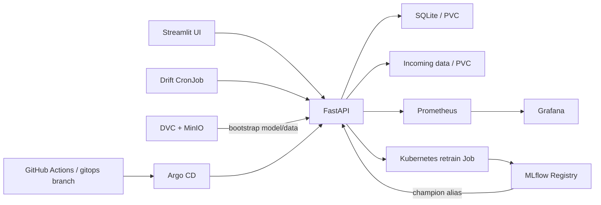

# Open Eyes Classifier — end-to-end MLOps

Учебная production-система бинарной классификации изображений глаз:

- `opened` — глаз открыт;
- `closed` — глаз закрыт.

Проект реализует полный цикл: inference → накопление размеченных и неразмеченных
данных → data/target/concept drift → alert → ручной или автоматический retrain →
регистрация и promotion модели в MLflow → горячая смена модели в FastAPI.

## Архитектура



Целевая среда — Minikube. Docker Compose предназначен для локальной разработки.

## Компоненты

| Компонент | Назначение |
|---|---|
| FastAPI | inference, history, drift, alerts, retrain, MLflow API, Prometheus metrics |
| Streamlit | inference, predictions, drift, alerts, experiments, retraining |
| DVC + MinIO | reference dataset и bootstrap-веса |
| MLflow | experiments, artifacts, Model Registry и alias `champion` |
| Prometheus/Grafana | технические, ML и business-like метрики |
| Kubernetes | сервисы, PVC, CronJob и retrain Job |
| Argo CD | автоматический GitOps deploy ветки `gitops` |

## Данные и модель

```text
data/
├── reference/
│   ├── opened/          # DVC tracked
│   └── closed/
└── incoming/
    ├── opened/          # production samples with true label
    ├── closed/
    └── unlabeled/
```

Bootstrap-веса `eye_cnn_best_val_final.pth` также отслеживаются DVC. В Git и
Docker-образы тяжёлые артефакты не включаются.

```bash
docker compose up -d minio createbucket
set AWS_ACCESS_KEY_ID=minioadmin
set AWS_SECRET_ACCESS_KEY=minioadmin
dvc pull
```

## Локальный запуск

Требования: Python 3.10, Docker Compose и DVC.

```bash
python -m venv .venv
# Windows
.venv\Scripts\activate
python -m pip install -r requirements-dev.txt

dvc pull
docker compose up --build
```

| Сервис | URL |
|---|---|
| OpenAPI | http://localhost:8000/docs |
| Streamlit | http://localhost:8501 |
| MLflow | http://localhost:5001 |
| Prometheus | http://localhost:9090 |
| Grafana | http://localhost:3000 (`admin` / `admin`) |
| MinIO Console | http://localhost:9001 (`minioadmin` / `minioadmin`) |

## API

| Method | Path | Назначение |
|---|---|---|
| `POST` | `/predict` | image и необязательный `true_label` |
| `GET` | `/predictions` | пагинация и фильтры |
| `POST` | `/drift/run` | drift report и решение об auto retrain |
| `GET` | `/drift/latest`, `/drift/history` | отчёты |
| `POST` | `/retrain` | manual retraining |
| `GET` | `/retrain/status` | local/Kubernetes jobs |
| `GET` | `/experiments`, `/models` | MLflow runs и Registry |
| `GET` | `/alerts` | постоянные уведомления |
| `GET` | `/health`, `/ready`, `/metrics` | operations endpoints |

Пример размеченного inference:

```bash
curl -X POST http://localhost:8000/predict \
  -F "file=@sample.png" \
  -F "true_label=opened"
```

## Drift и автоматический retrain

- data drift: KS test по яркости, дисперсии и гистограмме;
- target drift: изменение распределения истинных классов для размеченных данных;
- prediction drift: изменение распределения классов активной модели;
- concept drift: accuracy/F1 на размеченных production samples.

Отчёт содержит точную `model_version`; расчёт через API использует активный
MLflow `champion`. Пороговые значения находятся в `params.yaml`. CronJob запускает проверку каждые
10 минут. Auto retrain запускается только при drift, наличии минимум 20
размеченных новых изображений и завершённом часовом cooldown.

Кандидат получает alias `champion`, если validation accuracy не ниже `0.85` и
не хуже действующего champion более чем на `0.01`. Backend проверяет alias каждые
30 секунд и меняет модель атомарно без остановки API.

## Minikube и Argo CD

Репозиторий и GHCR считаются приватными. Токен не сохраняется в файлах:

```powershell
$token = Read-Host "GitHub PAT" -AsSecureString
.\scripts\bootstrap-minikube.ps1 `
  -GitHubUsername "your-user" `
  -GitHubToken $token `
  -RepositoryUrl "https://github.com/your-user/your-repository.git"
```

PAT должен иметь `repo` и `read:packages`. Скрипт:

1. устанавливает Argo CD в существующий Minikube;
2. создаёт private-repo, GHCR и MinIO secrets;
3. применяет Argo CD Application;
4. загружает DVC-артефакты в MinIO.

Полностью локальная проверка без GitHub использует локальные SHA-образы и
временный Git-сервер:

```powershell
.\scripts\bootstrap-minikube-local.ps1
.\scripts\smoke-minikube.ps1
```

Проверка:

```bash
kubectl get application -n argocd mlops-eyes
kubectl get pods,jobs,cronjobs -n mlops-eyes
kubectl port-forward svc/frontend-service 8501:8501 -n mlops-eyes
```

## CI/CD и Git flow

Используется GitHub Flow и Conventional Commits. Подробности:
[CONTRIBUTING.md](CONTRIBUTING.md).

Pull request:

1. semantic PR title;
2. Ruff и pytest;
3. DVC/Kustomize/Compose validation;
4. сборка backend/frontend образов.

Merge в `main` публикует `sha-<commit>` и `latest` в GHCR, затем обновляет
Kustomize tags в ветке `gitops`. Argo CD применяет immutable SHA-теги с
`prune` и `selfHeal`.

## Проверки

```bash
ruff check .
pytest -v --cov=backend --cov-fail-under=75
dvc dag
docker compose config --quiet
kubectl kustomize k8s/overlays/minikube
```

Полный сценарий демонстрации находится в [DEMO.md](DEMO.md), расширенное
руководство — в [docs/run_guide.md](docs/run_guide.md).
